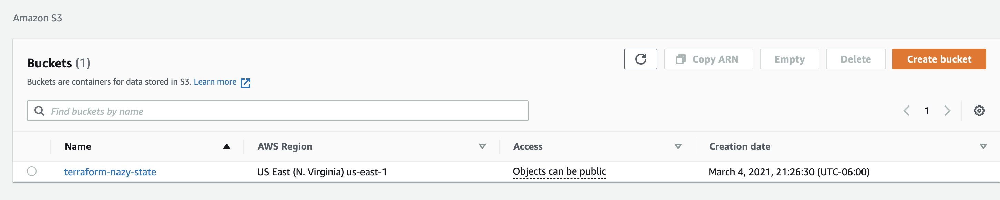

## Workspaces in terraform using modules. 

## Prerequisetes
- AWS account
- Terraform installed
- VS Code installed

## Folders structure 

In this template we have modules folder (child)  and dev/rds && qa/rds (root) folders, in child folder we leave the part which is all resources are described including ```providers``` file , just terraform block. 

```
terraform {
  required_version = "~> 0.14.0"
  required_providers {
    aws = {
      source  = "hashicorp/aws"
      version = "~> 3.0" # lazy restriction
    }
  }
}
```
<p>
We can add additional resources inside of the root module in this case it is pet_name resource, it can be changed depending on which environment you are creating your resources. 
</p>

The reason why we are leaving providers file in  child modules folder with keys=values ``` required_version = "~> 0.14.0"``` & ```version = "~> 3.0" ```  because when we call it we are going to  need to have terraform block, as well as we will know which version of terraform our code is compatible with. And if someone comes and uses our code they will know which version of terraform needs to be used. 
On rds example ```isolating environment``` happened using ```folders structure``` where only input variables changed, this is a one way of doing it. In both root modules ```dev``` && ```qa``` we are calling the same child ```rds``` module , but depending on environment its getting created in different environments. For ```qa``` env we added in child module ```pet_name``` resource and called it from there. So it brings us to the conclusion, that we can use the same template for different environments.

<p>
When we create rds db and  try to refer to it’s remote file from our web-server in root module we won’t be able  to find it, because in child web-server module we have remote state file, and our code will break,  in order to make it work we use map variables in child web-server module and define those variables in child module’s variables file and after that we should be able to pass our variables the  root web-server module.
When we call user_data from our root web-server module in child module we have to use “template = file("${path.module}/user_data.sh")” , otherwise it will look for the user_data inside of the root module and it won’t file it there, and it will give an error. But the path.module should solve that problem for us.
</p>

On AWS console it will look like this:



Content of state folder:


Content of dev environment folder:


Content of qa environmetn folder:


## Wrapper 

<p>
On top of the folder structure environment isolation we can also use wrapper which is creating isolated workspaces using Terraform. Most likely the wrapper type of work isolation you will use for pipeline and when you deploy your resources, you will get a drop down list and you can choose which environment you want and correct version of your resources.  Your pipeline will come and get dev.tf or qa.tf files from your tfvars folder,  but before that it has to set the correct backend where we used a placeholder for [env].
</p>

<p>
Inside of the wrappers folder we create  rds and webserver (root) module folders and each of them will have tfvars folder  with dev.tf and qa.tf files, values will be same as inside of the root module.
</p>

```
  env = "dev"
  storage = 12
  skip_snapshot = "true"
  instance_class = "db.t2.micro"
  username = "dev_user"

```

In the backend file of root rds module we have terraform block where we can’t use the interpolations, it has to be hard coded, to go around it we use place holder like ```[env]```. That allow us to supply different environments using values from dev.tf or qa.tf variables file. If its ```dev``` environment it will provision in ```dev environment``` , if it's ```qa``` environment it will create resources in ```qa environment```.  The next change we will have inside of the main.tf (root module rds) here since we give the values for environments in tfvars folder, we also create variables file where we define our given values in root rds module.

```
  env = var.env
  storage = 12
  skip_snapshot = var.skip_snapshot
  instance_class = var.instance_class
  username = var.username

```
We also create variables.tf file where we define our given values in root rds module file.

```
### Define root module variables

variable "env" {
    description = "the name of the environment"
    type = string
    default = "dev"
} 

variable "storage" {
    description = "the storage size of database"
    type = string
}

variable "skip_snapshot" {
    description = "it will skip the final snapshot incase if someone deletes database by accident"
    type = bool
}

variable "instance_class" {
    description = " database instance class"
    type = string
}

variable "username" {
    description = "the username of database"
    type = string
}

```

Bash script for changing environment:

```
#!/bin/bash
rm -rf .terraform/terraform.tfstate
ENV="$1"
sed -i ' ' -e "s|__env__|$ENV|" backend.tf
terraform init
echo "Environment is set to $ENV"

```