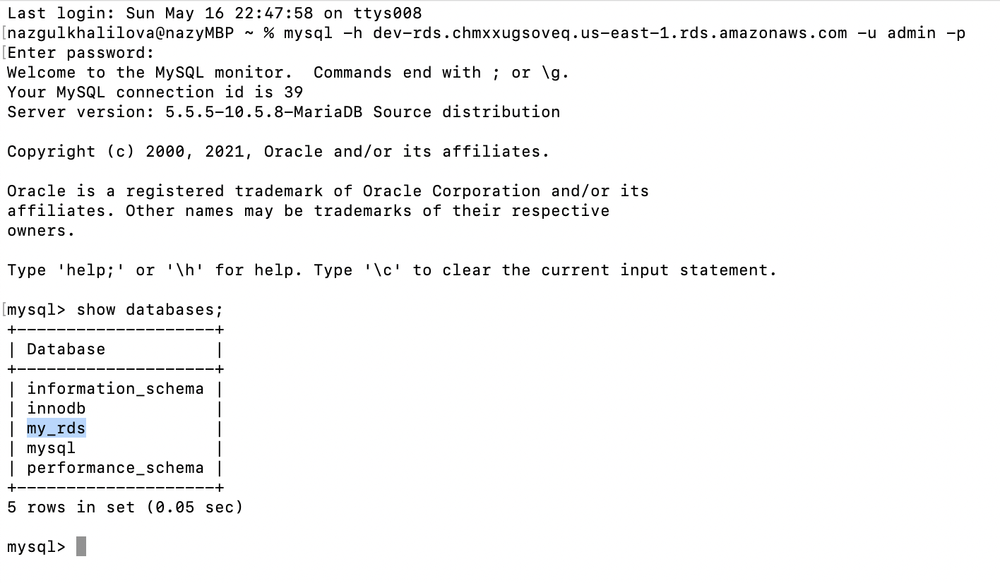
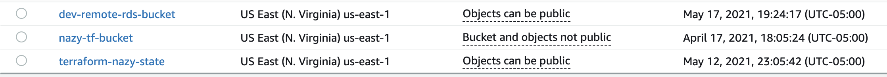
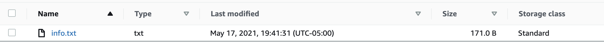
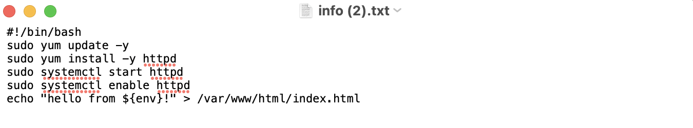

# Terraform RDS (backend) and Webserver (frontend). AWS S3 bucket object resource.

## Description

Here we have `rds` and `webserver`folders, both of them storing their state file remotely in the S3 bucket. So rds backend rds.tfstate is writing to terraform-nazy-state s3 bucket, and webserver can read from that backend, but webserver itself writing to different backend webserver.tfstate in the same s3 bucket. Access to those files should be restricted not publicly available.

```
terraform {
  backend "s3" {
  bucket         = "terraform-nazy-state"
  key            = "dev/rds.tfstate"      or for webserver it is "dev/webserver.tfstate"
  region         = "us-east-1"
  dynamodb_table = "terraform-state-locks"
  } 
}
```

You treat `*.tfstate file` as a sensitive file always use the encryption for the S3 bucket especially if it contains sensitive data. When we store state file remotely it gives us an ability retrive some data from it, for that we create a data source like this, where we tell Terraform where to get the data about already existing resources, in this case it is rds.tfstate file.

```
data "terraform_remote_state" "rds" {
  backend = "s3"
  config = {
    bucket = "terraform-nazy-state"
    key    = "${var.env}/rds.tfstate"
    region = "us-east-1"
  }
}
```

In rds outputs.tf file we used `sensitive = true` for the password of admin user, because we don't want it to be exposed to anyone it's a sensitive information. For this example we choose to use t2.micro instance type for webserver instance and for rds instance class is db.t2.micro, you can find it all in variables.tf

In `rds.tf` file we have an argument  `final_snapshot_identifier` which makes sure when rds database gets deleted final snapshot of it will be taken, but it must be provided if `skip_final_snapshot` is false. In our case we don't want make a final snapshot in dev environment, but for different environments make a snapshot. 
```
  .....
  skip_final_snapshot = var.skip_snapshot 
  final_snapshot_identifier = var.skip_snapshot == true ? null : "${var.env}-rds-snapshot"
  .....
```

Our rds doesn't have egress rule for security reasons and ingress rule open to our local machine and database itself. Since we open the port from our local machine we can get inside of our database by running command,
```
mysql -h endpoint_of_rds -u admin -p
```
It will be more clear in the next image,



Webserver contains application load balancer, autoscaling group, launch template, outputs.tf, variables file and remote state file. Having here remote_state.tf file as we said at the beginning gives us ability to get some data from rds.tfstate file. In our case we want to retrive endpoint of rds and the username of database.

```
output "rds_endpoint" { 
    value = data.terraform_remote_state.rds.outputs.address
    description = "this is the  address of rds instance"
}
output "username" {
    value = data.terraform_remote_state.rds.outputs.username
    description = "this is the  address of rds instance"
}
```

Another resource that we want to talk about is an `rds_s3_bucket` that we are created inside of the rds folder and from webserver folder we create `aws_s3_object` resource to write to that s3 bucket.

```
resource "aws_s3_bucket" "rds_bucket" {
  bucket = "${var.env}-remote-rds-bucket"
}

output "aws_remote_rds_bucket" {
  description = "id of rds_s3 bucket"  
  value = aws_s3_bucket.rds_bucket.id
}
```



Webserver web_s3_object.tf, here we are saying whatever we have in template_file/user_data.sh file write to `${var.env}-remote-rds-bucket` bucket under info.txt file.

```
resource "aws_s3_bucket_object" "object" {
  bucket = data.terraform_remote_state.rds.outputs.aws_remote_rds_bucket
  key    = "info.txt"
  content = "template_file/user_data.sh"
  #source = "template_file/user_data.sh"
}
```



