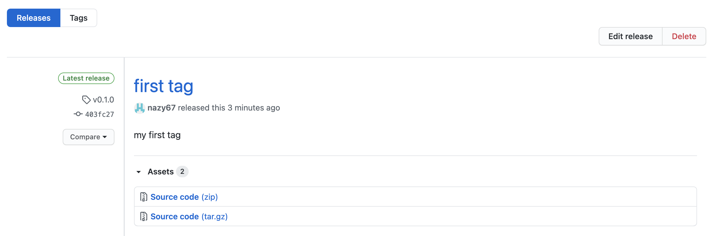

## S3 bucket module example

In this example for s3 bucket we will be attaching and detaching certain actions to bucket policyThe which will be applicable to bucket itself, not the objects inside of it. The next part of the bucket policy will show it:
```
  statement {
    actions = [
      "s3:ListBucket",
      "s3:DeleteBucket",
      "s3:GetBucketAcl",
      "s3:GetBucketPolicy"
    ]
    resources = [
      aws_s3_bucket.remote_state.arn,
    ]
```
The actions for the bucket policy inside of the bucket, which has two actions we won't touch and it looks like this:
```
  actions = [
    "s3:GetObject",
    "s3:PutObject",
  ]
    resources = [
    "${aws_s3_bucket.remote_state.arn}/*",
  ]
```
To do that we input the action we want to s3 module (child) file, and when we apply from the place where we are refering to that module it can automatically detect the change. 
We can also change the source of our root module , instead of getting it from our local module to module in github. 
```
module "s3_module" {
  source =  "../modules/s3"       ### in this line we change the source 

  s3_bucket_name = var.s3_name
  versioning_enabled = var.is_versioning_enabled
  principals = var.principals_list
  env = var.environment
}
```

After the changing of source to github we run 

```
terraform plan -var-file tfvars/dev.tf
``` 

it will give us that our infrastructure is up to date, then let's do some changes by adding another action to bucket policy and run

 ```
terraform plan -var-file tfvars/dev.tf
``` 

again, it won't do anything, because since our source is coming from github it doesn't know about our changes what we made locally, we have to push our code to github. After the pushing to github when we run 

```
terraform plan -var-file tfvars/dev.tf
``` 

it will still says that our infrastructure up to date.
The reason behind it because when we changed a source our ```child module``` dowloaded the source from the github locally, so that means we are still using the local version of our github. So for Terraform to get the newer version of our code we have to run 
```
terraform init -upgrade
```
which will force terraform to download the newer version of github to local ```child module```. After that we should be able to run: 

```
tf plan -var-file tfvars/dev.tf
``` 
and after 
```
tf apply -var-file tfvars/dev.tf
``` 
But each time when we run

```
terraform init -upgrade
```

it takes longer to download the newer version of our code, since we want just the updated part of the code we can run, 
```
terraform get -update
```
It will get just resent changes. 

Incase if our ```child module``` is managed by other team or someone else and they do some changes in that file, as an example we take tags:

```
   tags = {
    Name        = var.s3_bucket_name
    Environment = var.env
  }
```
We have our module source in github and if we want specific version of our code we have to specify it in the source module by refering to it

```
module "s3" {
  source =  "github.com/nazy67/terraform//session_9/modules/s3?ref=main"

```
or specific branch on github. The next example will show how we can refer to a specific branch.
We will create a new branch on github 
```
git checkout -b nazy-branch 403fc276a3ea18234c2c9c314a202e8fdbed9aea 
```

this is the one of older version of the code on github, we push it to github from our nazy_branch 
```
git push --set-upstream origin nazy_branch
```
On the source of the root module
```
module "s3" {
  source =  "github.com/nazy67/terraform//session_9/modules/s3?ref=nazy_branch"
```
After that we will refer to that nazy_branch and run
```
terraform get -update
``` 
it will get us the needed version of our code. But still it's not a pefect solution for us , what if someone do some changes on that branch. In that case we can refer to a specific commit, using releases on github. We create a tag using release , we choose resent commit and use it to refer to that commit.



```
module "s3" {
  source =  "github.com/nazy67/terraform//session_9/modules/s3?ref=v0.1.0"
```
So when we make a commit changes to github we create a tag for that change and later on use it for getting the needed version of code.

## Notes

The lifecycle setting all affect how Terraform constucts and rraverses the dependency graph. As a result, only literal values can be used befause the processing happens too early for arbitrary expression evaluation. It means that we can't use prevent destroy as a variable.
When you give a name for your s3 bucket don't use underscore just hyphens are excepted. 
When we want to use the specific version of our code, not the latest one we can specify the version in ```child module``` that compitable with our code.
Using modules in Terraform is not just for reusability  it's also used to restrict you from creating  the resources that are not complaint with the company policies.  For that they are introduce one layer of check not to allow you to create those resources.
