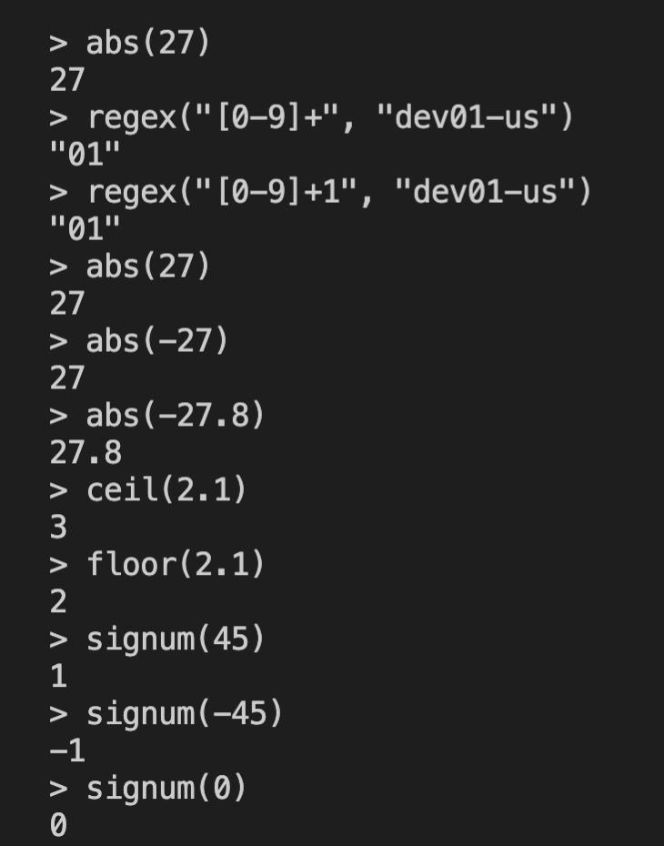
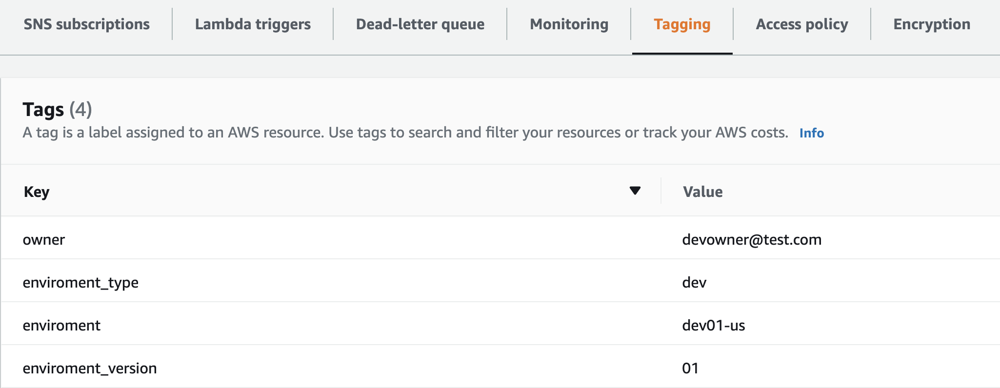
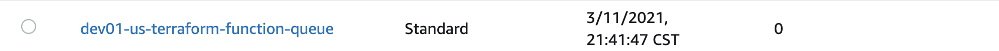

## Terraform functions

There a lot of funcitons in terraform, for different used cases. 
To test some of the terraform numeric function you can use terraform console and test them there, especially numeric functions. ```abs``` function returns the absolute value. ```ceil``` and ```floor``` functions are oposite of each other, will round up or down the closest whole number. ```signum``` gives three outputs if it's positive number it gives ```1```, if it's ```0``` it gives ```0```, and if it's negative it gives ```-1```.



We will create sqs with full environment name and use terraform functions to retrive the environment name from the given locals, but before doing that we need to understand waht ```full environment name``` is, explanation is given next:
```
environment = dev01-us
```
dev - is the name of environment
01 - is the version of application
us - is the market name,  in this case it's US market

We created locals for our sqs resource tags, where we give our environment name and environment owner, so if something happens to our resource the message will be sent to that team or person , who created that resource. So what happens is we retrive the information about the environment name and attach it to the name resouce we used format function:
```
name = format("%s-terraform-function-queue", var.env)
```
After that we used other functions as ```regex``` and ```substr``` functions to get the right name and version of our environment. In locals we also created ```env_short = substr(var.env, 0, 3)``` so we can refer to it from the tags in locals. We also want to get the ```key``` ("dev") by passing the ```value```("devowner@test.com") in the map of ```env_to_owner```, for that, we use ```lookup``` function. It will look like this:
```
owner = lookup(local.env_to_owner, local.env_short, "devowner@test.com")
```
So now we can see that when we create our sqs in the tags we should see this:



And the name of sqs resource will come at the begining with the name of environment:



## Links
 https://www.terraform.io/docs/language/functions/index.html
